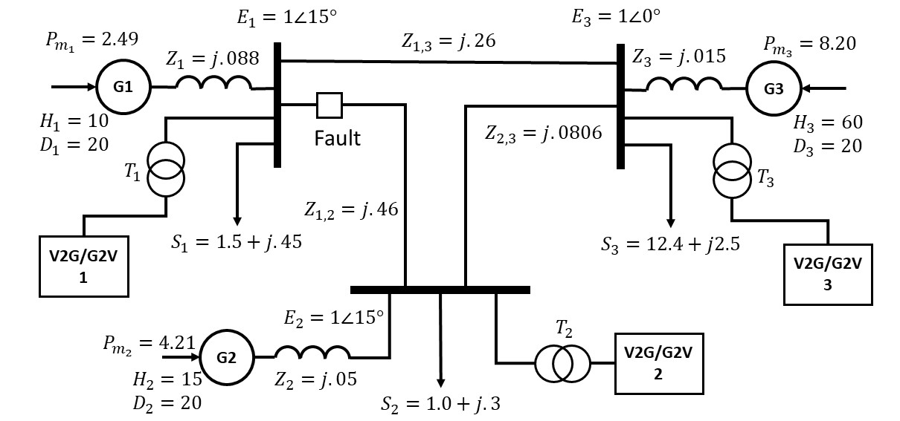
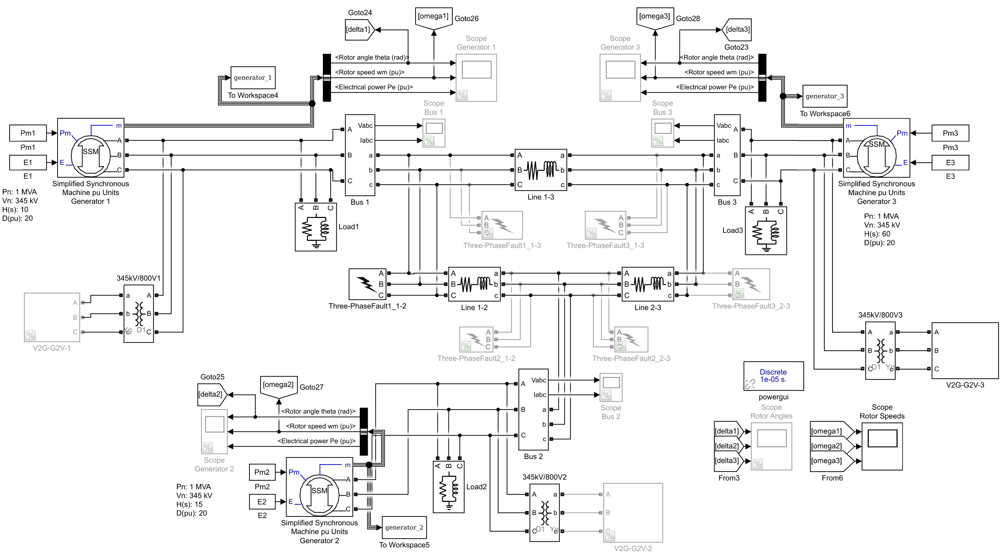

# v2g-g2v-ieee3-transient
A MATLAB/Simulink source code for simulating vehicle-to-grid (V2G) and grid-to-vehicle (G2V) transient stability simulations on a modified IEEE-3 bus case.  
The grid consists of a 3-bus 3-generator system with a V2G/G2V system on each bus and short-circuit faults as shown in the figure below. 

<p align="center">
  
</p>


<p align="center">
  
</p>

You can choose which V2G/G2V bus or which fault location is active by commenting or uncommenting the corresponding Simulink block.  
However, it is advisable to run the Simulink file using the `main_v2gg2v.m` file.

## Requirements
`MATLAB 2017a` or more recent versions

## Tutorial: How do I run it?
1. Open the `main_v2gg2v.m` file.

1. Select the simulation case by uncommenting only one of the `sim_case`.  
Available `sim_case` options:
   - **'NoV2GG2V'** : IEEE-3 bus grid without any V2G/G2V connected
   - **'V2G_Gajduk'** : V2G mode with Gajduk's local frequency control
   - **'V2G_FDCC'** : V2G mode with RMS fault detection (FD) and battery constant current (CC) control
   - **'G2V'** : G2V mode with constant battery current

1. Select which bus will have their V2G/G2V system activated by uncommenting only one of the `active_bus`.  
Available `active_bus` options:
   - **active_bus = 1**
   - **active_bus = 2**
   - **active_bus = 3**
   - **active_bus = [1,2,3]** (The V2G/G2V system in all of the buses are active.)

1. Select which `plot_bus` will have their V2G/G2V states plotted on a figure.  
Available `plot_bus` options:
   - **plot_bus = active_bus** (This is the default option. It will plot the same buses defined in `active_bus`.)
   - **plot_bus = 1**
   - **plot_bus = 2**
   - **plot_bus = 3**

1. Choose the fault location (fault_loc) *x_y-z* where:  
*x*: location of the fault at bus *x*  
*y-z*: location of the fault between transmission line bus *y-z*  
Available `fault_loc` options:
   - **fault_loc = '1_1-2'**
   - **fault_loc = '1_1-3'**
   - **fault_loc = '2_1-2'**
   - **fault_loc = '2_2-3'**
   - **fault_loc = '3_1-3'**
   - **fault_loc = '3_2-3'**

1. Edit the fault clearing time (FCT) and other case-specific variables in the Pre-tuned Options section.

1. Run `main_v2gg2v.m`.
It will automatically open and run the resulting Simulink file.  
If you want to pause or stop the simulation, 
open one of the Simulink scopes and click the `Pause` or `Stop` button.

## Citations
This source code was implemented for a paper in progress. If you intend to use it in your work, please cite it as
> B. P. Putra and A. I. Cahyadi, "v2g-g2v-ieee3-transient" [Online]. Available: <https://github.com/BagaskaraPutra/v2g-g2v-ieee3-transient>.

This work was also inspired by the work of others. Please check them out and cite them as well.
1. > Arancibia A, Strunz K. Modeling of an electric vehicle charging station for fast DC charging. 2012 IEEE International Electric Vehicle Conference, IEVC 2012. 2012;(3).
      ```
      @article{Arancibia2012,
      doi = {10.1109/IEVC.2012.6183232},
      isbn = {9781467315623},
      journal = {2012 IEEE International Electric Vehicle Conference, IEVC 2012},
      number = {3},
      publisher = {IEEE},
      title = {{Modeling of an electric vehicle charging station for fast DC charging}},
      year = {2012}
      }
      ```
1. > Gajduk A, Zdraveski V, Basnarkov L, et al. A Strategy for Power System Stability Improvement via Controlled Charge/Discharge of Plug-in Electric Vehicles. arXiv. 2015; (June). Available from: http://arxiv.org/abs/1506.07097.
      ```
      @article{Gajduk2015,
      archivePrefix = {arXiv},
      arxivId = {1506.07097},
      author = {Gajduk, Andrej and Zdraveski, Vladimir and Basnarkov, Lasko and Todorovski, Mirko and Kocarev, Ljupco},
      eprint = {1506.07097},
      journal = {arXiv},
      number = {June},
      title = {{A Strategy for Power System Stability Improvement via Controlled Charge/Discharge of Plug-in Electric Vehicles}},
      url = {http://arxiv.org/abs/1506.07097},
      year = {2015}
      }
      ```
1. > Gajduk A, "vehicle2grid-stability-analysis" [Online]. Available: <https://github.com/gajduk/vehicle2grid-stability-analysis>.